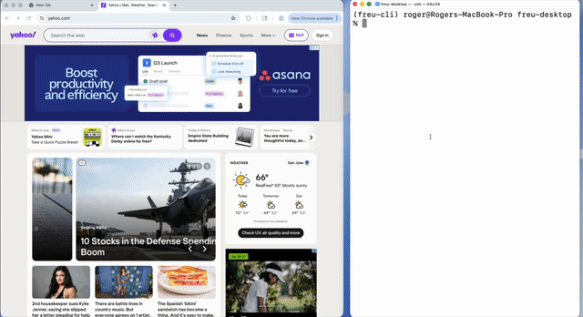

# 🦦 Freu CLI

💸 **Cut your AI agent's token usage by up to 90%** — offload repeated tasks to deterministic programs. Record a browser session once with Freu CLI, and it's compiled into a reusable *skill command*. From then on, your agent just loads the skill into its context window and invokes the command directly, skipping expensive DOM analysis and step-by-step reasoning on every run.



👀 Vision-based desktop automation coming soon!


```
+-----------------------+     HTTP (127.0.0.1:8787)      +----------------+
|  Chrome extension     | <----------------------------> |  freu-cli      |
|  (user interaction &  |                                |  bridge        |
|   CDP command runner) |                                |  (Python HTTP) |
+-----------------------+                                +----------------+
                                                            |
                                        +-------------------+
                                        |                   |
                                        v                   v
                           learn (capture + LLM)         run <- skill
                           -> SKILL.md + <Cmd>.json      DSL steps
                           + log/ intermediates
```

---

## 📦 Install

```bash
pip install .
```

### 🧩 Chrome extension

`freu-cli` talks to the browser through the **Freu AI Browser Automater** Chrome extension.
See [here](https://github.com/freu-ai/browser-automater-extension).

### 🤖 LLM provider

`freu-cli learn` picks its LLM from **`LLM_MODEL`** (default `gpt-5.1`)
and routes the call through [LiteLLM](https://github.com/BerriAI/litellm),
so any of these providers work — just export the matching API key:

| Provider   | Example `LLM_MODEL`           | Required env         |
|------------|-------------------------------|----------------------|
| OpenAI     | `gpt-5.1` *(default)*         | `OPENAI_API_KEY`     |
| Anthropic  | `claude-sonnet-4-5`           | `ANTHROPIC_API_KEY`  |
| Google     | `gemini/gemini-2.5-pro`       | `GEMINI_API_KEY`     |
| xAI        | `xai/grok-4`                  | `XAI_API_KEY`        |
| MiniMax    | `minimax/MiniMax-M2`          | `MINIMAX_API_KEY`    |

Any other provider LiteLLM supports works too — consult the
[LiteLLM providers list](https://docs.litellm.ai/docs/providers) for the
model-prefix and env-var names. If the required key is missing,
`freu-cli learn` errors out *before* capture starts so you never record
a session to find out afterwards.

---

## 🚀 Quickstart

### 1. 🎓 Learn a skill

```bash
# OpenAI (default) — LLM_MODEL is optional
export OPENAI_API_KEY=sk-...

# Or, pick another provider:
# export LLM_MODEL=claude-sonnet-4-5
# export ANTHROPIC_API_KEY=...

freu-cli learn ./github-skill --objective "Star a GitHub repository by URL"
```

Interact with the browser — click, type, navigate. When you're done, hit
`Ctrl-C`. `freu-cli` then narrates the learn pipeline as it runs:

```
Captured /path/to/log_1745553600/events.json
Learning automation. This may take a minute...
Loaded 4 raw event(s) from events.json.

Stage 1/4 — Normalize: distill raw DOM events into semantic actions.
  → 2 action(s):
     1. navigate_web 'repository page' — open the repository URL
     2. click_element 'Star' — click the Star button

Stage 2/4 — Resolve: prune captured DOM graphs into stable constellations.
  [1/1] click_element 'Star' → <button> 'Star'
  → resolved 1/1 target-bearing event(s) into constellations.

Stage 3/4 — Identify: detect retrieval objectives and locate value-bearing elements.
  → not a retrieval objective; no outputs declared.

Stage 4/4 — Synthesize: turn resolved actions into a reusable skill.
  → 'GitHub': 1 command(s), 2 step(s) total
    • StarRepository (2 step(s)) — Open a GitHub repository by URL and star it.

Validated. Writing skill files...
```

`--objective` is optional but strongly recommended; it shapes how the
LLM splits the recording into named commands.

When learning finishes, the skill folder looks like this:

```
./github-skill/
├── SKILL.md
├── StarRepository.json             # one JSON per command; the LLM decides the split
└── log_1745553600/
    ├── events.json           # raw DOM events captured from the extension
    ├── normalized.json       # stage 1 output
    ├── resolved.json         # stage 2 output (pruned constellations)
    ├── identified.json       # stage 3 output (retrieval plan, if any)
    └── synthesized.json      # stage 4 output (skill with constellations bound into DSL)
```

Instead of compressing each click into a brittle CSS selector, `freu-cli`
captures a **constellation** — the clicked element plus its ancestors,
nearby neighbors, children, and a tag-specific semantic anchor (label
for inputs, `<select>` around options, list around items, table around
rows/cells). The resolve stage prunes auto-generated classes / ids /
attrs, and at run time a page-context scorer picks the best live match
for each constellation. Pages can reshuffle, rename classes, or rotate
runtime hashes — skills keep working.

**Capturing return values.** When the objective is phrased as retrieving
information ("find …", "get …", "look up …", "check the price of …"),
`freu-cli learn` runs an extra **identify** stage that inspects the
final DOM snapshot and locates the value-bearing element on the page.
That target is compiled into a `browser_get_element_text` (or
`browser_get_element_attribute`) step plus a declared command output.
You don't need to do anything special during the recording — no
keyboard shortcut, no copy. Just navigate to the page where the value
is visible and stop the capture.

Running `freu-cli learn` again on the same folder ADDS commands to the existing skill — each synthesized command is either appended or replaced in place.

See [`docs/skill-format.md`](docs/skill-format.md) for the full schema and
the list of supported DSL methods.

### 2. ▶️ Run the skill

Any of these forms work — pick whichever fits your invocation style:

```bash
# By skill folder + command name
freu-cli run ./github-skill StarRepository --repository-url https://github.com/freu-ai/freu-cli

# By SKILL.md path + command name
freu-cli run ./github-skill/SKILL.md StarRepository --repository-url https://github.com/freu-ai/freu-cli

# By direct <Command>.json path
freu-cli run ./github-skill/StarRepository.json --repository-url https://github.com/freu-ai/freu-cli
```

The runtime narrates each step in domain terms (the `description` the
synthesizer attached to the step) with the underlying browser call in
parentheses:

```
Step 1: Open the GitHub repository page. (Opening https://github.com/freu-ai/freu-cli)
Step 2: Click the Star button on the repository page. (Clicking <button> 'Star')

OK
```

When a step fails, the runtime prints an agent-friendly recovery block
listing what worked and what was being attempted, instead of a stack
trace:

```
FAILED.

Completed steps:
  1. Open the GitHub repository page.

Pending step:
  Click the Star button on the repository page.

Reason: element not found: button[data-action=star]
```

The same shape is available programmatically on the result dict
(`completed_steps`, `failed_step`, `error`) for callers wrapping
`freu-cli run` from code.

## 🔌 Agent integrations

Once you've learned a skill, drop it into your agent's skills directory
and it becomes available as a reusable command. Any agent that discovers
`SKILL.md` files from a convention directory will pick freu skills up
automatically.

| Agent       | Skills directory     | Example                                    |
|-------------|----------------------|--------------------------------------------|
| OpenClaw    | `~/.openclaw/skills` | `cp -R ./github-skill ~/.openclaw/skills/` |
| Claude Code | `~/.claude/skills`   | `cp -R ./github-skill ~/.claude/skills/`   |
| Codex CLI   | `~/.codex/skills`    | `cp -R ./github-skill ~/.codex/skills/`    |
| Cursor      | `~/.cursor/skills`   | `cp -R ./github-skill ~/.cursor/skills/`   |
| Hermes      | `~/.hermes/skills`   | `cp -R ./github-skill ~/.hermes/skills/`   |

## 🧪 Running the tests

```bash
pip install -e .[dev]
pytest
```


## 📜 License
GNU Affero General Public License. See [LICENSE](LICENSE).
